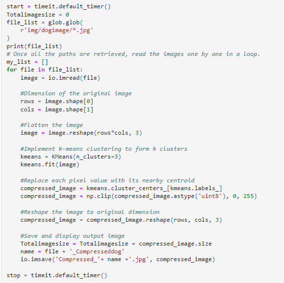
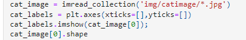
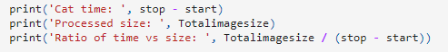
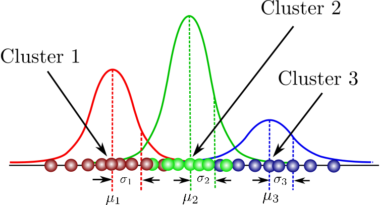
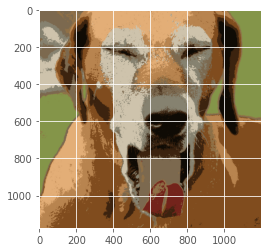
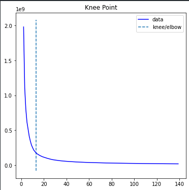

# CS105 Image Compression With Machine Learning

## Introduction:
We are building an image compression tool using the k-means cluster algorithm that will output an image with fewer colors resulting in a lower file size. We plan to use k-means to identify centroids within the RGB color scale of an image. Once the cluster is generated, the image will have fewer bits of color. The tool should work with any image that is fed through it.

## Goal:
Lower file size and output a compressed image.

## Data:
Any image. (For the purpose of this project we compiled a collection of images with cats and dogs).

## Tools Used:
K-means Clustering
Gaussian Clustering
Kneepoint elbow finding

## Process:
Data Loader (Shibin Chen)
Pixel data has 3 channels: a red, green and blue channel for each pixel. The goal of our data loader is to turn an image into a list of arrays, each array containing the RGB pixel value for red, green and blue values. A white pixel would appear as [255,255,255] because values range from 0 to 255. We normalize the data to range from 0 to 1, so a white pixel will appear as [1,1,1].

Import the image so we can shape into its respective RGB pixel values.

Run K-means clustering through all the stored images we collected. Compress them via replacing each pixel with nearby centroids. Reshape it back to its original dimension, and save the new compress images into a folder.

We call the function timeit.default_timer() so we can calculate how long it takes to compress all the images of cats and dogs. Yielding a result that shows cat images compress faster than dog images. 

## K-means clustering 
Given a k, create a model with k clusters. Each cluster is a color. The KMeans algorithm works by shifting k cluster centers into their optimal location (the algorithmic mean of each color in the cluster) by loss minimization. When an instance n becomes closer to one cluster center than its current cluster center, it swaps centers. We partition n instances into k clusters. 

## Gaussian Mixture Model (Diego Vega)
Given a k, create a model with a specified number of clusters. The gaussian mixture model works by assuming the data is a mixture of gaussians, we wanted to explore whether this model could also work to cluster the image data and if it is perhaps faster or more accurate. The fitting follows a similar method to k-means, gradually shifting the centers and standard deviations towards a loss minimum. 

For this particular example we implemented an eleven(11) component GM model to reproduce the compress image below. Implementation was really simple. By calling the Gaussian Mixture function from sklearn. We were able to determine its means and then run a for loop to predict the proper pixels and arrange them to produce the picture on the right.

			

Compressing Image
To compress the image, we shift each pixel to it’s nearest cluster. A gray might become a white, for example. 

## Optimal K (Severin Field)
The optimal k is the number of clusters which finds the number of clusters which is “optimal” for an image. In other words, where adding more colors (clusters) does not add much accuracy to the model because new colors are the same as older colors. The goal of this project is ultimately to use as few colors as possible to still see a good image. Inertia is a measure of dispersion within a cluster. If a cluster is all very close together, the inertia is small. If a cluster is spread out, the inertia is large. So with two clusters, the color differences between the cluster centers will vary wildly, while with 200 different colors (clusters), the colors won’t have to undergo such a large shift. Our hypothesis is that the inflection point on the “inertia vs k” graph will minimize the file size most efficiently while maximizing quality. K’s beyond this point have diminishing returns in reducing the number of colors, which we believe will lower file size. 

Initially, we just found the elbow by finding the k whose inertia was in the 90th percentile of inertias (because further increasing k would only yield 10% extra returns). Though this method works, we opted for an off the shelf elbow finding method to find the optimal k.

Using this image of a cat, we found the dispersion / variation across clusters (inertia) for a range of k, and then plotted them with the elbow finding class. We find an optimal k of 17 colors for this image and now have a pipeline that can be applied to any image. 

## Cats vs. Dogs (Shibin Chen)
We wanted to know if different types of images may cluster faster. We hypothesized that if there are fewer colors or if the colors in an image are more similar, less computational power would be needed to create a model. We ran a test with a set of dog images and a set of cat images and recorded the times each one took:

Image
Size
Time
Ratio time vs. size
100 cat images
23927649 pixels
270 sec
88767 pixels/sec
100 dog images
59957052 pixels
670 sec
89403 pixels/sec

## Conclusion (Samarth and Cody): 
Overall, our goal for this project was to see how we can use the k-means cluster algorithm to lower file size and output a compressed image. We initialized arrays representing pixel values of the image, and using the k means clustering, we compressed the image into the nearest clusters depending on the optimal k, which represented the least amount of colors that could be presented without losing the quality of the image. By plotting the dispersion among clusters with the elbow finding class, we found that the optimal K colors in an image was 17, which could be applied to other images with a similar effect. Finally, we tested multiple images to see if there were other variations that would lead to different cluster speeds, such as a fewer number of colors, and concluded that based on our variables, cat images took more time to cluster than dogs. 

## Questions:
As Inertia Increases, what happens to K Clusters? 
How does a K-means clustering image compression determine how close a location is from a cluster? 
Based on the results, which animal picture took longer to compress? 
